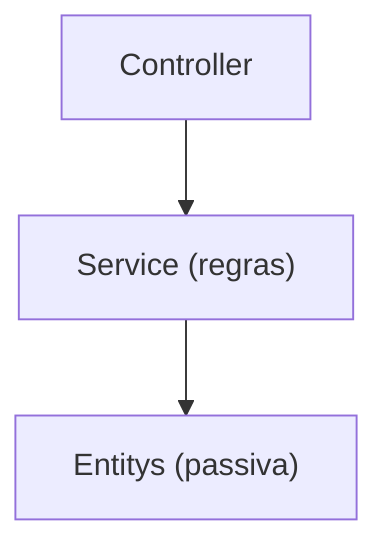
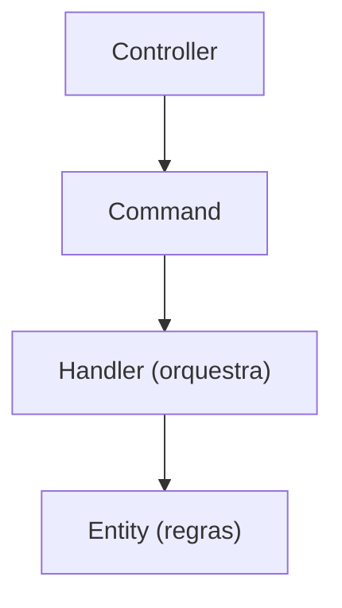

# CQRS and Mediator Pattern

## CQRS (Command Query Responsibility Segregation)

CQRS é um padrão que organiza as operações de escrita separada das de leitura. 

Ele define os seguintes itens:

- **Command** → muda o estado do sistema
    - Executa uma ação
    - Pode alterar o banco
    - Não retorna dados complexos (geralmente void ou Result)
    - Sua nomenclatura já expressa a sua inteção

- **Query** → apenas consulta dados (não altera nada)
    - Apenas leitura
    - Nunca altera estado
    - Retorna DTOs

- **Handler** → é um Orquestrador
    - Não é o dono da regra de negócio
    - Recebe um Command ou Query
    - Chama os métodos do Domínio
    - Persiste e Retorna resultado

### Benefícios
- Código mais simples de entender pela melhoria na *Separação de Responsabilidades* através da redução da complexidade dentro dos componentes individuais
- Leitura e escrita podem evoluir separadamente facilitando a *Escalabilidade* dos recursos pela independência das operações
- Facilita a elaboração de testes mais simples e com objetivos mais explícitos
- Alinhado aos padrões da Clean Architecture

## O Padrão Mediator
Com o Mediator você centraliza a comunicação deixando para a biblioteca a escolha do Handler que responderá a requisição facilitando a implementação do CQRS.

No .NET a implementação mais popular utiliza a biblioteca MediatR.

**Em vez de**: Controller → Service → Repository

**Você tem**: Controller → Mediator → Handler

Nesse caso a controller não sabe quem trata o comando.

### Benefícios
- Controllers finos (Somente tratará o HTTP repassando ao handler a implementação do Caso de Uso)
- Lógica mais modular e organizada 
- Arquitetura limpa

### Problemas
- Esse padrão não atende a recomendação *Dependência Explícita* por "esconder" a dependência do Handler necessário a requisição.
- Não é possível navegar para a implementação do Handler pelo menu rápido do Visual Studio

### Quando usar
- Sistema médio/grande
- Regras de negócio relevantes
- Precisa de organização e testabilidade
- Clean Architecture
- Domínio Rico

### Evite quando
- CRUD muito simples
- Aplicações pequenas
- Time sem maturidade arquitetural
- Poucas regras

## CQRS, OO e Clean Architecture
Com o CQRS toda a orientação a objetos fica no DOMÍNIO (Entidades e Value Objects).

Ela organiza os Casos de Uso e não o comportamento do Domínio.

Dessa maneira a regra fica na Entidade (ela possui informações e comportamentos):

- **Commands** = “quero mudar algo”
- **Queries** = “quero ver algo”

Quando a entidade somente possui dados e outra define os comportamentos (Service Layer) isso não é OO (modelo anêmico).

O CQRS somente solicita o comando mantendo a regra na entidade ele organiza o "quando" e OO define o "como".

### Dessa maneira:
- Entidades DEVEM ter métodos
- Propriedades ficam protegidas (private set) forçando o uso de métodos
- Regras ficam no domínio
- Handlers apenas coordenam e não possuem regras
- As Queries não são e nem usam domínios pois não tomam decisões e devem realizar somente leitura

## O modelo clássico de Service Layer
O **Service Layer** é um padrão clássico que responde "o que o sistema faz" de forma simples e rápido, mas que cresce mal.

- A lógica de negócio fica na camada de Serviços
- O Controller chama diretamente métodos do serviço
- Um mesmo método pode ler e escrever 
- A entidade só tem dados

### Benefícios
- Com complexidade baixa
- Fácil para CRUD
- Menos classes

### Problemas 
- Serviços tendem a crescer demais
- Métodos fazem “de tudo” e regras ficam espalhadas
- Difícil evoluir regras complexas
- Menor clareza de intenção
- Testes unitários mais difícies
- A Entidade não fica protegida e qualquer código pode mudar o seu estado
- As Controllers são mais inteligentes e por vezes também possui regra de negócio

### Resumindo:

O **CQRS** responde "o que o usuário quer fazer agora" gerando mais classes porém muito mais organizado.

| Aspecto               | Service Layer      | CQRS          |
|-----------------------|-----------------|---------------|
| Organização           | Por serviços     | Por comandos e consultas |
| Leitura / Escrita     | Misturadas       | Separadas     |
| Clareza de intenção   | Média            | Alta          |
| Escalabilidade        | Limitada         | Alta          |
| Número de classes     | Menor            | Maior         |
| Complexidade inicial  | Baixa            | Média         |
| Testes unitários      | Mais difíceis    | Mais fáceis   |
| Controllers           | Mais lógicos     | Muito finos   |

### Modelo Service

### Modelo CQRS

## Código de Exemplo
Foi elaborato um projeto de exemplo onde demonstro algumas das principais características desse padrão. 

Também adicionei um modelo de implementação tratricional com Services para facilitar a comparação da organização e erros comuns que violam as boas práticas.

Algumas considerações consideradas para facilitar o exemplo:
- O projeto está em modelo Monolito
- Não foi implementado a camada de Infrastructure
- Não foi considerada a necessidade de tarefas assíncronas

Acesse primeiramente o *Program.cs* para identificar cada uma.

- **Tradicional Services**: Na implementação da ProductController
- **CQRS puro**: Na implementação do CustomerController
- **CQRS usando padrão Mediator (MediatR)**: Na implementação do OrderController

## Referência
https://balta.io/blog/aspnet-core-cqrs-mediator

https://medium.com/@ulomaobilookenyi/cqrs-with-mediatr-in-asp-net-core-a-practical-guide-to-decoupled-architecture-7398f7eec846
